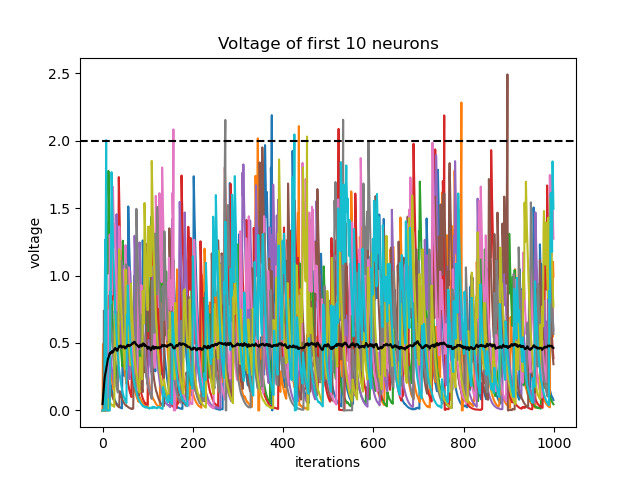
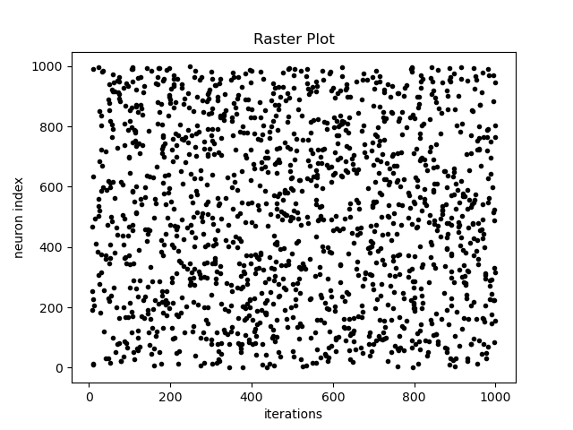

Tutorial
########

Create and Simulate a Simple Network
************************************

Just like ``PymoNNto``, each ``Network`` in ``PymoNNtorch`` is composed of ``NeuronGroup`` s, which indicates the neuronal population, and possible ``SynapticGroup`` (s), which defines the synaptic connection between the ``NeuronGroup`` s. ``Network`` is the main container of all network objects (including itself) and hence, should be defined first. For instance, to create a network of 1000 neurons with regressive synaptic connections, we write: ::

    from pymonntorch import *

    net = Network()
    ng = NeuronGroup(net=net, size=1000, behavior={})
    syn = SynapseGroup(net=net, src=ng, dst=ng, tag='GLUTAMATE')

So far, ``ng`` has been added to network ``net`` and synaptic connection has been defined to connect ``ng`` to itself, i.e. both afferent and efferent synapses of ``ng`` are ``syn``. By default, each network and its components are created on CPU and the data type of any tensor inside the objects is set to ``torch.float32``. Pass an argument ``settings`` to the ``Network`` to change these default setups. ``settings`` is a dictionary with keys ``device`` and ``def_dtype`` which indicate the device and data type of everything within the network, respectively.

To have a functioning network, we can write ``Behavior`` (s) for different network objects to define dynamics and attributes for them. To do so, we can proceed as follows: ::

    class BasicBehavior(Behavior):  # Any user-defined behavior should inherit pymonntorch.NetworkCore.Behavior
        # This behavior is defining dynamics for NeuronGroups
        def initialize(self, neurons):  # override this method to define and initialize attributes. This is called upon calling Network's initialize method.

            super().initialize(neurons)  # Always remember to call the super method to ensure all objects and tensors are located on the same device.

            neurons.voltage = neurons.vector(mode="zeros")
            self.threshold = 2.0

        def forward(self, neurons):  # override this method to define what happens in each iteration of the simulation.
            firing = neurons.voltage >= self.threshold
            neurons.spike = firing.byte()
            neurons.voltage[firing] = 0.0 # reset
            
            neurons.voltage *= 0.9 # voltage decay
            neurons.voltage += neurons.vector(mode="uniform", density=0.1)

Now, we can modify the instantiation of ``ng`` by::

    ng = NeuronGroup(net=net, size=1000, behavior={1: BasicBehavior()})

Note that each behavior is given an index upon being assigned to a network object. This indexing scheme indicates the order in which the behaviors should be initialized and then, simulated in each iteration. For instance, assume we have also defined a behavior as follows: ::

    class InputBehavior(Behavior):
        def initialize(self, neurons):
            super().initialize(neurons)

            for synapse in neurons.afferent_synapses['GLUTAMATE']:
                synapse.W = synapse.matrix('uniform', density=0.1)
                synapse.enabled = synapse.W > 0

        def forward(self, neurons):
            for synapse in neurons.afferent_synapses['GLUTAMATE']:
                neurons.voltage += synapse.W@synapse.src.spike.float() / synapse.src.size * 10

Now, assume we have defined ``ng`` by::
    
    ng = NeuronGroup(net=net,
                     size=1000,
                     behavior={
                        1: BasicBehavior(),
                        2: InputBehavior()
                    })

In this manner, the attributes defined in ``BasicBehavior`` are initialized, and then the ones defined in ``InputBehavior``. Moreover, in each iteration of the network simulation, the dynamics defined in ``BasicBehavior``'s ``forward`` method are applied prior to the ones for ``InputBehavior``.

To initialize and simulate the network for 1s, we write: ::

    net.initialize()
    net.simulate_iterations(1000)

Monitoring The Simulation
*************************

In most simulations, we need to keep track of variables through time. To do so, the so-called ``Recorder`` modules is useful, as it saves a buffer of the variable(s) we intend to track throughout the simulation. Let's add recorders to track the voltage and spike activity of neurons in ``ng`` in above example: ::

    net = Network()
    ng = NeuronGroup(net=net,
                    size=1000, 
                    behavior={
                        1: BasicBehavior(),
                        2: InputBehavior(),
                        9: Recorder(['voltage', 'mean(voltage)']),
                        10: EventRecorder(['spike'])
                    })
    SynapseGroup(ng, ng, net, tag='GLUTAMATE')
    net.initialize()
    net.simulate_iterations(1000)

``EventRecorder`` is a subclass of ``Recorder`` which facilitates tracking of sparse boolean tensors by saving them in memory-efficient way (key-value scheme). Note that we have defined the two recorders in some late indices (9 & 10) to ensure every change has taken place on the desired variables. We can now plot the recorded variables to observe their behavior throughout the simulation: ::

    import matplotlib.pyplot as plt

    plt.plot(net['voltage', 0][:,0:10])
    plt.plot(net['torch.mean(voltage)', 0], color='black')
    plt.axhline(ng['BasicBehavior', 0].threshold, color='black', linestyle='--')
    plt.xlabel('iterations')
    plt.ylabel('voltage')
    plt.title('Voltage of first 10 neurons')
    plt.show()

    plt.plot(net['spike.t', 0], net['spike.i', 0], '.k')
    plt.xlabel('iterations')
    plt.ylabel('neuron index')
    plt.title('Raster Plot')
    plt.show()

